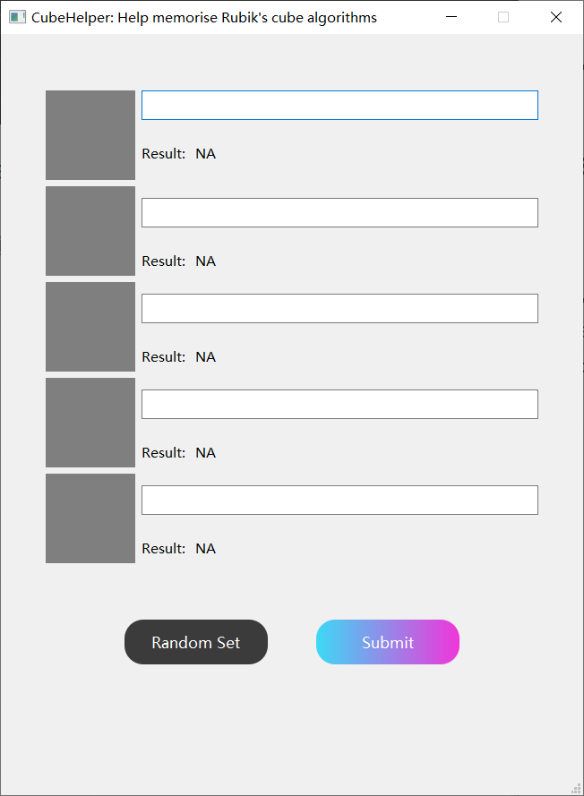
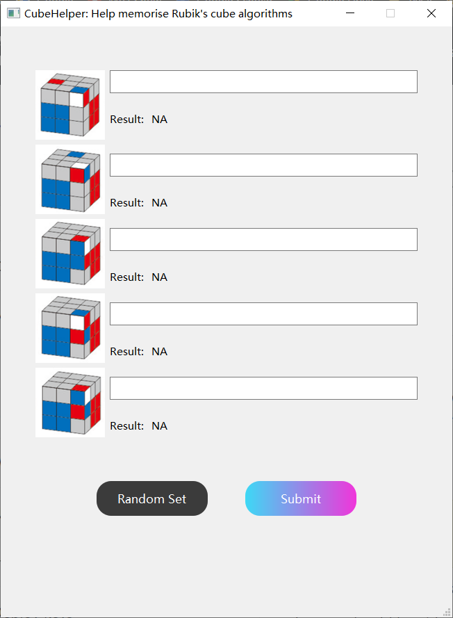
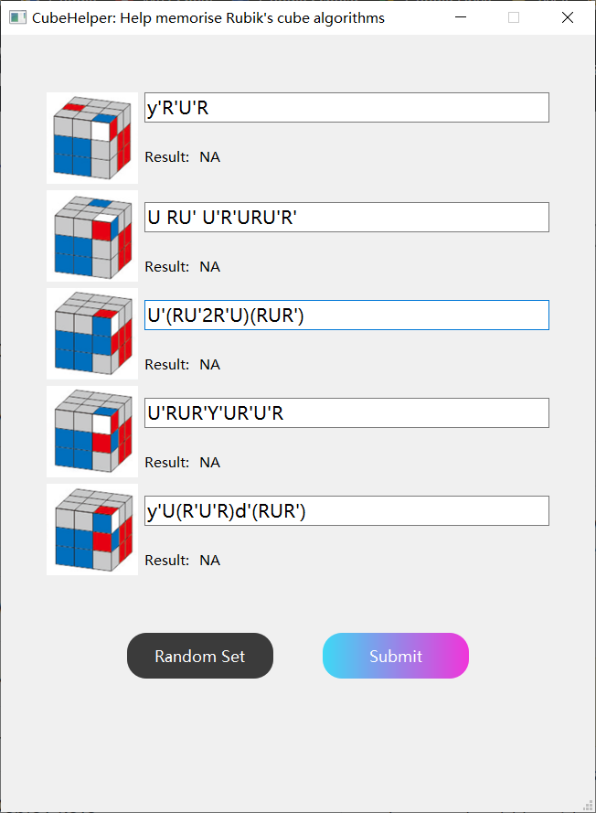
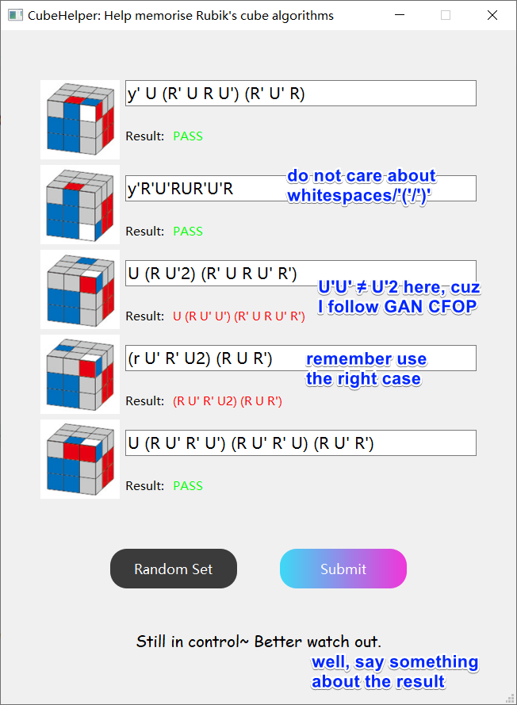

# cube-algs-dictator
Used for writing algorithms of solving Rubik's cube from memory.

## Usage

- Command: `python main.py`.
- Or just click `run.bat` in working directory.

## Preview

| Startup                     | Click `Random Set` at anytime | Write answers using characters | Click `Submit`              |
| --------------------------- | ----------------------------- | ------------------------------ | --------------------------- |
|  |    |     |  |

## TBD

- OLL, PLL algorithms... (planned ddl: 2021/08/01 I guess)
- Timer for answering the blanks (planned ddl: 2021/08/10 I guess)
- Can choose test set from multiples (planned ddl: 2021/08/30)
- Algorithm set without images, i.e. pure data in text (planned ddl: 2021/09/30)
- Multiple solutions (don't really wanna do this, so planned ddl: 2021/12/31 and the item might be canceled)
- **Suggestions are welcomed!**

